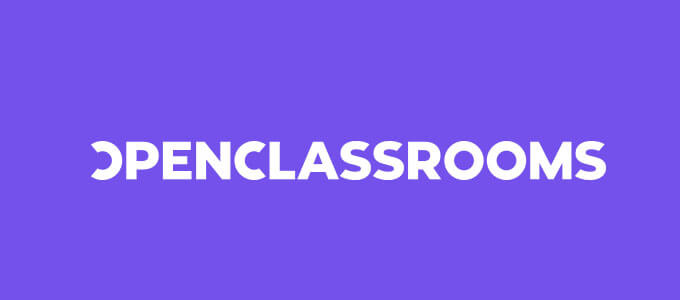

# OpenClassRooms Projects

    
    

        In this repo, you'll find all the projects I did while my training at OpenClassRooms. Those who allow me to graduate as 
        <b>Mobile application developer for iOS.</b>
    

## Presentation

### OpenClassRooms

OpenClassRooms is an online french training organisation counting more than 300,000 studients connected each month over the world.

_**"Our mission is to make education accessible - everywhere, for everyone"**_

### Route

In this training, each student have to realize different projects, helped by their mentor. Most of them are coding projects, and others are about differents essential skills (github, git, project management, ...)

Each project must be validated by the mentor while a filmed defense to move to the next one.

When all the projects have been validated, all defenses are analyzed by a jury which determine if you're graduated.

## Projects

Here I listed all coded projects I did while this training.

- [**New Warrior Quest**](https://github.com/imick666/NewWarriorQuest): A project where I discovered bases about Swift language.
- [**Instagrid**](https://github.com/imick666/InstaGrid): A simple photo montage app using story board and ImagePicker.
- [**Count On Me**](https://github.com/imick666/CountOnMe): A calculator I had to fix and write UnitTests.
- [**Reciplease**](https://github.com/imick666/Recipllease): A recipes search tool with API call and coreData usage.
- [**Ultimate Traveller Tool**](https://github.com/imick666/UltimateTravellerTool): A travel app with some fonctionnality I choosed and API call.
- [**Project Asgard**](https://github.com/imick666/Project-Asgard): Personnal project. A Dog breeding manager.

## Thanks

I would like to thank my mentors, [Sebastien Bastite](https://github.com/bastides) and [Aurelien Antonio](https://github.com/AurelienEC). They followed and helped me all along my training.